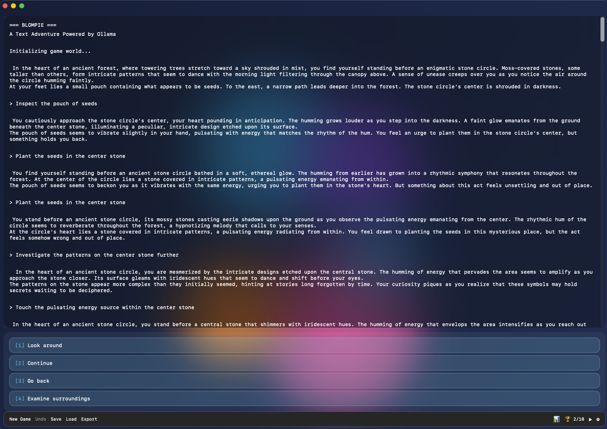

# Blompie



A Zork-style text adventure game for macOS powered by Ollama AI with streaming responses, multiple save slots, and customizable themes.

## Overview

Blompie is a classic text adventure game that uses local AI (Ollama) to generate an interactive narrative experience. Unlike traditional text adventures with preset puzzles and objectives, Blompie creates a dynamic world where the AI game master responds to your actions and crafts unique adventures on the fly.

## Features

### Core Gameplay
- **Streaming responses** ⚡ - Watch text appear in real-time as the AI generates it
- **AI-powered narrative** - Uses Ollama for dynamic story generation
- **Action-based gameplay** - Click buttons to choose your actions
- **No fixed objectives** - Pure exploration and discovery

### Customization
- **5 Color themes** 🎨
  - Classic Green (traditional terminal)
  - Amber Terminal (warm amber on black)
  - Retro Blue (cyan on dark blue)
  - Paper Mode (black on cream)
  - Matrix Green (bright green hacker style)
- **Multiple AI models** 🤖 - Switch between mistral, llama3.2, llama3.1, codellama, phi
- **Font size adjustment** - Use ⌃⇧+ and ⌃⇧- to resize text (8-36pt)

### Save System
- **Multiple save slots** 💾 - Save unlimited games with custom names
- **Rich metadata** - See save date and message count
- **Load manager** - Easy access to all your saved games
- **Auto-save** - Automatic backup of your progress

### Export & Sharing
- **Export transcript** 📄 - Save your entire adventure as a text file
- **Includes metadata** - Export date, model used, and message count
- **Shareable** - Perfect for sharing your adventures

## Requirements

- macOS 14.0 or later
- [Ollama](https://ollama.ai) installed and running locally
- At least one Ollama model installed (mistral recommended)

## Installation

### Option 1: Download Release
1. Download the latest Blompie.app from [Releases](https://github.com/kochj23/Blompie/releases)
2. Move to Applications folder
3. Launch Blompie

### Option 2: Build from Source
1. Clone this repository:
   ```bash
   git clone https://github.com/kochj23/Blompie.git
   cd Blompie
   ```

2. Open `Blompie.xcodeproj` in Xcode

3. Build and run (⌘R)

## Usage

1. **Start Ollama:**
   ```bash
   ollama serve
   ```

2. **Install a model** (if you haven't already):
   ```bash
   ollama pull mistral
   ```

3. **Launch Blompie** from Applications

4. **Play:**
   - Read the narrative text
   - Click action buttons to make choices
   - Watch responses stream in real-time

5. **Customize:**
   - Click the ⚙ (Settings) icon for themes
   - Use the Model menu to switch AI models
   - Adjust font size with ⌃⇧+ and ⌃⇧-

6. **Save your progress:**
   - Click **Save** and enter a custom name
   - Click **Load** to see all your saves
   - Click **Export** to save as text file

## Keyboard Shortcuts

- `⌃⇧+` - Increase font size
- `⌃⇧-` - Decrease font size

## How It Works

Blompie communicates with Ollama running on `localhost:11434`. The game sends your actions to your selected AI model, which acts as a game master, describing the world and presenting new actions based on your choices.

The AI is instructed to:
- Create immersive, mysterious worlds
- Respond with vivid descriptions
- Present 2-4 possible actions after each response
- Track inventory and game state implicitly
- Make the world feel alive and responsive

## Architecture

- **SwiftUI** - Modern declarative UI framework
- **MVVM Pattern** - Clean separation of concerns
- **Streaming API** - URLSession bytes for real-time responses
- **UserDefaults** - Persistent settings and save slots
- **Async/Await** - Modern concurrency

### Key Components

- `BlompieApp.swift` - App entry point with keyboard shortcuts
- `ContentView.swift` - Main UI with terminal, dialogs, and controls
- `GameEngine.swift` - Core game logic, state, and save management
- `OllamaService.swift` - Ollama API client with streaming support
- `ColorTheme.swift` - Theme definitions and color management

## Customization

### Change Default Model

Edit `GameEngine.swift` line 44:
```swift
@Published var selectedModel: String = "mistral"  // Change to your preferred model
```

### Modify System Prompt

Edit `GameEngine.swift` lines 74-94 to change how the AI behaves as game master.

### Add Custom Themes

Add new themes in `ColorTheme.swift`:
```swift
static let myTheme = ColorTheme(
    id: "myTheme",
    name: "My Custom Theme",
    textColor: CodableColor(red: 1.0, green: 0.5, blue: 0.0),
    backgroundColor: CodableColor(red: 0.0, green: 0.0, blue: 0.1)
)
```

Then add it to `allThemes` array.

## Troubleshooting

**"Error connecting to Ollama"**
- Make sure Ollama is running: `ollama serve`
- Check Ollama is on port 11434
- Verify your selected model is installed: `ollama list`

**"Model not found"**
- Install the model: `ollama pull mistral`
- Or switch to an installed model using the Model menu

**Slow responses**
- Larger models (llama3.1, codellama) are slower
- Try mistral or phi for faster responses
- Check your system has enough RAM for the model

## License

MIT License - see [LICENSE](LICENSE) file for details

## Credits

Created by Jordan Koch ([@kochj23](https://github.com/kochj23))

Powered by [Ollama](https://ollama.ai)

## Version History

### v1.1.0 (2024-12-30)
- Added streaming responses
- Multiple save slots with metadata
- Model selector dropdown
- Export transcript feature
- 5 color themes
- Enhanced error messages
- Settings panel

### v1.0.0 (2024-12-30)
- Initial release
- Terminal-style interface
- AI-powered gameplay
- Save/load system
- Font size adjustment
