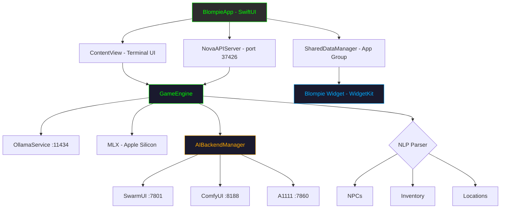
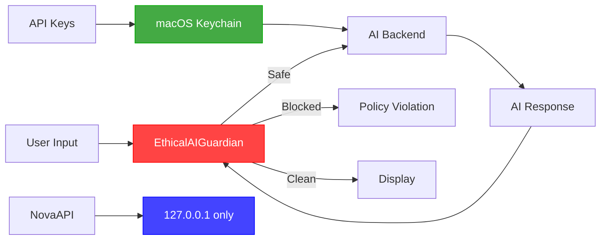

# Blompie


[](https://opensource.org/licenses/MIT)


**AI-Powered Text Adventure Engine for macOS -- Every Playthrough Is Unique**

Blompie is a native macOS text adventure game that connects to local AI backends
(Ollama, MLX) to generate infinite, procedural interactive fiction. An AI dungeon
master creates characters, locations, plots, and consequences in real time based
entirely on the player's free-form text input. No two sessions are ever the same.

Written by Jordan Koch.

---

## Architecture


```mermaid
graph TD
    A[BlompieApp - SwiftUI] --> B[ContentView - Terminal UI]
    A --> C[NovaAPIServer - port 37426]
    A --> D[SharedDataManager - App Group]

    B --> E[GameEngine]
    C --> E

    E --> F[OllamaService :11434]
    E --> G[MLX - Apple Silicon]
    E --> H[AIBackendManager]
    D --> I[Blompie Widget - WidgetKit]

    H --> J[SwarmUI :7801]
    H --> K[ComfyUI :8188]
    H --> L[A1111 :7860]

    E --> M{NLP Parser}
    M --> N[NPCs]
    M --> O[Inventory]
    M --> P[Locations]

    style A fill:#2d2d2d,color:#00ff00,stroke:#00ff00
    style E fill:#1a1a2e,color:#00ff00,stroke:#00ff00
    style H fill:#1a1a2e,color:#ffaa00,stroke:#ffaa00
    style I fill:#1a1a2e,color:#00aaff,stroke:#00aaff
```

### Data Flow


```mermaid
sequenceDiagram
    participant Player
    participant ContentView
    participant GameEngine
    participant OllamaService
    participant NLPParser

    Player->>ContentView: Type action
    ContentView->>GameEngine: performAction()
    GameEngine->>GameEngine: saveStateSnapshot (undo)
    GameEngine->>OllamaService: chat(messages)
    OllamaService-->>GameEngine: AI narrative response
    GameEngine->>NLPParser: parseOllamaResponse()
    NLPParser-->>GameEngine: narrative + actions + NPCs + items
    GameEngine->>GameEngine: checkAchievements()
    GameEngine-->>ContentView: Update UI
    ContentView-->>Player: Display narrative + action buttons
```

### Security Layers


```mermaid
graph LR
    A[User Input] --> B[EthicalAIGuardian]
    B -->|Safe| C[AI Backend]
    B -->|Blocked| D[Policy Violation]
    C --> E[AI Response]
    E --> B
    B -->|Clean| F[Display]

    G[API Keys] --> H[macOS Keychain]
    H --> C

    I[NovaAPI] --> J[127.0.0.1 only]

    style B fill:#ff4444,color:white,stroke:#ff0000
    style H fill:#44aa44,color:white,stroke:#00aa00
    style J fill:#4444ff,color:white,stroke:#0000ff
```

---

## Features

### Gameplay

- **Infinite procedural adventures** -- the AI dungeon master generates every
  location, NPC, item, quest, and plot twist on the fly.
- **Free-form text input** -- type anything in natural language; the AI adapts.
- **Dynamic NPCs** -- characters remember your actions and have their own
  motivations, quirks, and dialogue.
- **Inventory and location tracking** -- items, places, and NPCs are parsed
  from AI responses and tracked automatically.
- **Achievement system** -- 10+ unlockable achievements (First Steps, Explorer,
  World Traveler, Social Butterfly, Diplomat, Collector, Hoarder,
  Conversationalist, Veteran Adventurer, Trader).
- **Multiple genres** -- fantasy, sci-fi, mystery, horror, comedy.
- **Configurable tone** -- Serious, Balanced, or Whimsical.
- **Configurable detail level** -- Brief, Normal, or Detailed descriptions.

### Save System

- **8 manual save slots** plus automatic autosave.
- **Undo stack** -- rewind up to 20 actions.
- **Export** -- save a full game transcript as plain text.

### Visual Design

- **Retro terminal aesthetic** -- green-on-black by default, with five built-in
  color themes: Classic Green, Amber Terminal, Retro Blue, Paper Mode,
  Matrix Green.
- **Adjustable font size** -- keyboard shortcuts for quick resizing.
- **Glassmorphic UI** with smooth scrolling and monospaced type.
- **Real-time streaming** -- watch the AI write token by token, or switch to
  instant mode.
- **Token-per-second meter** -- live performance indicator.

### AI-Generated Imagery (Optional)

- Scene illustrations, character portraits, item visualizations, and location
  artwork generated via SwarmUI, ComfyUI, or Automatic1111.
- Six prompt styles: Realistic, Artistic, Fantasy, Pixel Art, Cartoon, Anime.

### macOS Widget (WidgetKit)

Added in v1.2.0. Three sizes:

| Size   | Shows                                                |
|--------|------------------------------------------------------|
| Small  | Adventure name, quick stats                          |
| Medium | Last action, action count, achievement progress bar  |
| Large  | Full game state, AI backend status, detailed progress|

Widget data syncs via the shared App Group `group.com.jkoch.blompie`.

### Random Model Mode

Enable automatic model rotation -- after a configurable number of actions the
engine switches to a randomly selected Ollama model, producing unpredictable
narrative shifts mid-adventure.

### Nova / OpenClaw API

Blompie exposes a local HTTP API on port **37426** (loopback only, no
authentication required) for programmatic play by AI agents.

| Method | Endpoint                          | Description                         |
|--------|-----------------------------------|-------------------------------------|
| GET    | /api/status                       | App status and uptime               |
| GET    | /api/ping                         | Health check                        |
| GET    | /api/models                       | Available Ollama models             |
| POST   | /api/adventure/new                | Start a new adventure session       |
| GET    | /api/adventure/sessions           | List active sessions                |
| GET    | /api/adventure/:id/state          | Current state (messages, inventory) |
| POST   | /api/adventure/:id/action         | Send a command, get AI response     |
| GET    | /api/adventure/:id/history        | Full message history                |
| POST   | /api/adventure/:id/save           | Save session to slot                |
| GET    | /api/adventure/:id/saves          | List save slots                     |
| POST   | /api/adventure/:id/undo           | Undo last action                    |
| DELETE | /api/adventure/:id                | End and delete session              |

```bash
# Quick status check
curl -s http://127.0.0.1:37426/api/status | python3 -m json.tool

# Start a new adventure via API
curl -X POST http://127.0.0.1:37426/api/adventure/new \
  -H "Content-Type: application/json" \
  -d '{"model":"mistral","tone":"whimsical","detail":"detailed"}'
```

---

## Requirements

| Requirement          | Minimum                         | Recommended               |
|----------------------|---------------------------------|---------------------------|
| macOS                | 13.0 (Ventura)                  | 14.0+ (Sonoma)            |
| RAM                  | 8 GB                            | 16 GB (for MLX models)    |
| Architecture         | Universal (Intel + Apple Silicon)| Apple Silicon              |
| AI Backend           | Ollama **or** MLX               | Ollama with mistral model |

---

## Installation

Blompie is distributed as a DMG disk image. It is **not** available on the
Mac App Store.

### From DMG (Pre-built Binary)

1. Download the latest DMG from
   [Releases](https://github.com/kochj23/Blompie/releases).
2. Open the DMG and drag **Blompie.app** to your Applications folder.
3. Launch Blompie from Applications or Spotlight.

### Build from Source

```bash
git clone git@github.com:kochj23/Blompie.git
cd Blompie
open Blompie.xcodeproj
# Press Cmd+R to build and run
```

Xcode 15 or later is required.

### AI Backend Setup

You need at least one local AI backend running before Blompie can generate
adventures.

**Ollama (recommended):**

```bash
brew install ollama
ollama serve
ollama pull mistral:latest
```

**MLX (Apple Silicon only):**

```bash
pip install mlx-lm
# Blompie auto-detects MLX when available
```

Blompie will automatically fall back from MLX to Ollama if the preferred
backend is unavailable.

---

## How to Play

1. Launch Blompie. The AI generates an opening scene automatically.
2. Type any action in the input field: `look around`, `talk to the merchant`,
   `open the chest`, `cast a spell on the door`.
3. Press Enter. The AI responds with narrative and a set of suggested actions.
4. Click a suggested action or type your own.
5. Use `/save`, `/load`, `/undo`, `/stats`, or `/help` for system commands.

### Example Session

```
> You wake up in a dimly lit tavern. The smell of ale and smoke fills the air.
> What do you do?

look around

> You see a hooded figure in the corner, a barkeep polishing glasses,
> and a notice board with various quests. Stairs lead up to rooms.

talk to hooded figure

> The figure looks up, revealing a scarred face. "You looking for work?
> The mayor needs someone brave -- or foolish. Talk to her at the town hall."
```

### Tips

- Be descriptive. "Carefully open the creaking wooden door" produces richer
  narrative than "open door".
- Talk to NPCs. They have deep personalities and may offer quests, items,
  or vital information.
- Save often. You have 8 slots plus autosave.
- Experiment. There are no wrong answers -- the AI adapts to anything.

---

## Technical Details

### Project Structure

```
Blompie/
  BlompieApp.swift           -- App entry point, starts NovaAPIServer
  ContentView.swift          -- Main terminal UI (SwiftUI)
  GameEngine.swift           -- Core game loop, save/load, achievements
  OllamaService.swift        -- Ollama HTTP client (chat + streaming)
  ColorTheme.swift           -- 5 terminal color themes
  NovaAPIServer.swift        -- REST API for AI agent integration
  SharedDataManager.swift    -- App Group data sync for widget
  ImageGenerationService.swift -- SwarmUI/ComfyUI/A1111 image gen
  ImageGenerationView.swift  -- Image generation UI
  TokenMeterView.swift       -- Tokens/sec performance display
  AICapabilities/            -- Unified AI capability detection
  Design/                    -- Modern UI design components
Blompie Widget/
  BlompieWidget.swift        -- WidgetKit extension (S/M/L)
  WidgetData.swift           -- Widget data model
  SharedDataManager.swift    -- Widget-side App Group reader
AIBackendManager.swift       -- Multi-backend detection (Ollama, MLX,
                                TinyLLM, TinyChat, OpenWebUI, cloud)
AIBackendManager+Enhanced.swift
AIBackendManager+EthicalGuardian.swift
AIBackendManager+Generation.swift
AIBackendStatusMenu.swift    -- Backend status UI
EthicalAIGuardian.swift      -- Content moderation and policy enforcement
```

### Key Design Decisions

- **SwiftUI + AppKit** -- native macOS, no Electron, no web views.
- **No app sandbox** -- `com.apple.security.app-sandbox` is set to `false`
  because the app needs unrestricted localhost network access to reach Ollama,
  MLX, and image generation backends.
- **Keychain for secrets** -- all API keys are stored in macOS Keychain via the
  Security framework. Keys are never stored in UserDefaults, plists, or source.
- **Streaming responses** -- the Ollama client supports both streaming
  (token-by-token) and batch modes.
- **Ethical AI Guardian** -- a mandatory content moderation layer that screens
  all AI input and output for policy violations.
- **NLP parsing of AI output** -- the game engine heuristically extracts NPCs,
  inventory items, and locations from the AI's narrative text so it can track
  game state without a structured data contract from the model.

### Supported AI Backends

| Backend        | Type             | Default Port | Notes                        |
|----------------|------------------|--------------|------------------------------|
| Ollama         | Text LLM         | 11434        | Primary, recommended         |
| MLX            | Text LLM         | --           | Apple Silicon native, local  |
| TinyLLM        | Text LLM         | 8000         | Lightweight server           |
| TinyChat       | Text LLM         | 8000         | Jason Cox chatbot interface  |
| OpenWebUI      | Text LLM         | 8080 / 3000  | Self-hosted AI platform      |
| SwarmUI        | Image generation  | 7801         | Flux models                  |
| ComfyUI        | Image generation  | 8188         | Node-based workflows         |
| Automatic1111  | Image generation  | 7860         | Stable Diffusion WebUI       |
| OpenAI         | Cloud LLM        | --           | GPT-4o (API key in Keychain) |
| Google Cloud   | Cloud LLM        | --           | Vertex AI                    |
| Azure          | Cloud LLM        | --           | Cognitive Services           |
| AWS            | Cloud LLM        | --           | Bedrock                      |
| IBM Watson     | Cloud LLM        | --           | NLU, Speech, Discovery       |

---

## Troubleshooting

**AI not responding:**
- Verify Ollama is running: `ollama serve`
- Verify a model is installed: `ollama list`
- Try pulling a model: `ollama pull mistral:latest`

**Slow responses:**
- Use a smaller, faster model (e.g., `mistral` or `phi`).
- Switch to MLX on Apple Silicon for Neural Engine acceleration.
- Close memory-intensive applications.

**Game feels stuck / AI repeats itself:**
- Try a more specific command.
- Use `/undo` to rewind and try a different approach.
- Adjust the temperature slider (higher = more creative, lower = more focused).

**Widget not updating:**
- Ensure the app and widget share the App Group `group.com.jkoch.blompie`.
- Rebuild both targets in Xcode.

---

## Test Suite

Blompie includes a comprehensive XCTest suite covering models, services,
security, and integration.

| Test File | Category | Tests | What It Covers |
|-----------|----------|-------|----------------|
| GameEngineTests | Unit | 18 | Models (GameMessage, GameState, SaveSlot, Achievement, DetailLevel, ToneStyle), settings persistence, theme management, undo, export, achievements |
| OllamaServiceTests | Unit | 17 | OllamaMessage/Request/Response codable contracts, token/sec calculation, error descriptions |
| ColorThemeTests | Unit | 15 | All 5 themes, CodableColor round-trips, uniqueness, SwiftUI conversion |
| AIBackendManagerTests | Unit | 17 | 10 backend enum cases, AIError/ImageError descriptions, Keychain service name, singleton, image style/size |
| SecurityTests | Security | 14 | No hardcoded API keys, no plaintext passwords, no personal emails, Keychain usage verified, loopback-only API, sandbox disabled, EthicalAIGuardian source analysis |
| WidgetDataTests | Unit | 8 | WidgetGameData codable, achievement progress, AIBackendInfo, SharedDataManager singleton |
| ResponseParsingTests | Functional | 23 | System prompt generation, detail/tone settings, model selection, random model mode, save/load/delete slots, streaming, temperature, undo stack |
| NovaAPIServerTests | Integration | 4 | Port 37426, loopback binding, /api/status, /api/ping |

**Run tests:**

```bash
cd Blompie
xcodebuild -scheme Blompie -configuration Debug -destination 'platform=macOS' test
```

---

## Version History

| Version | Date           | Highlights                                       |
|---------|----------------|--------------------------------------------------|
| 1.2.0   | February 2026  | macOS WidgetKit support (Small/Medium/Large)     |
| 1.1.0   | January 2026   | MLX backend, Apple Silicon optimization          |
| 1.0.0   | December 2024  | Initial release, Ollama integration, save system |

---

## Security and Privacy

- **100% local by default.** All AI inference runs on your Mac. No data leaves
  the machine unless you explicitly configure a cloud backend.
- **No telemetry.** Zero analytics, tracking, or phone-home behavior.
- **Keychain storage.** API keys stored in macOS Keychain, never in plaintext.
- **Ethical AI Guardian.** Mandatory content moderation layer that cannot be
  disabled. Screens prompts and responses for policy violations.
- **Loopback-only API.** The Nova API server binds to 127.0.0.1 -- no external
  network exposure.

---

## License

MIT License -- Copyright (c) 2024 Jordan Koch

See [LICENSE](LICENSE) for the full text.

---

## More Apps by Jordan Koch

| App | Description |
|-----|-------------|
| [MLXCode](https://github.com/kochj23/MLXCode) | Local AI coding assistant for Apple Silicon |
| [GTNW](https://github.com/kochj23/GTNW) | Global Thermal Nuclear War strategy game |
| [NewsSummary](https://github.com/kochj23/NewsSummary) | AI-powered news aggregation and summarization |
| [MailSummary](https://github.com/kochj23/MailSummary) | AI-powered email categorization and summarization |
| [JiraSummary](https://github.com/kochj23/JiraSummary) | AI-powered Jira dashboard with sprint analytics |

[View all projects](https://github.com/kochj23?tab=repositories)

---

> **Disclaimer:** This is a personal project created on my own time. It is not
> affiliated with, endorsed by, or representative of my employer.
