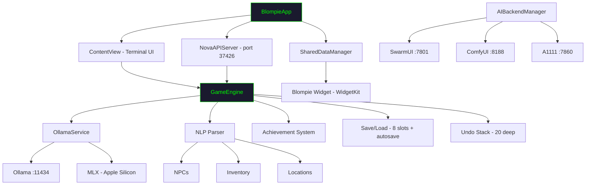
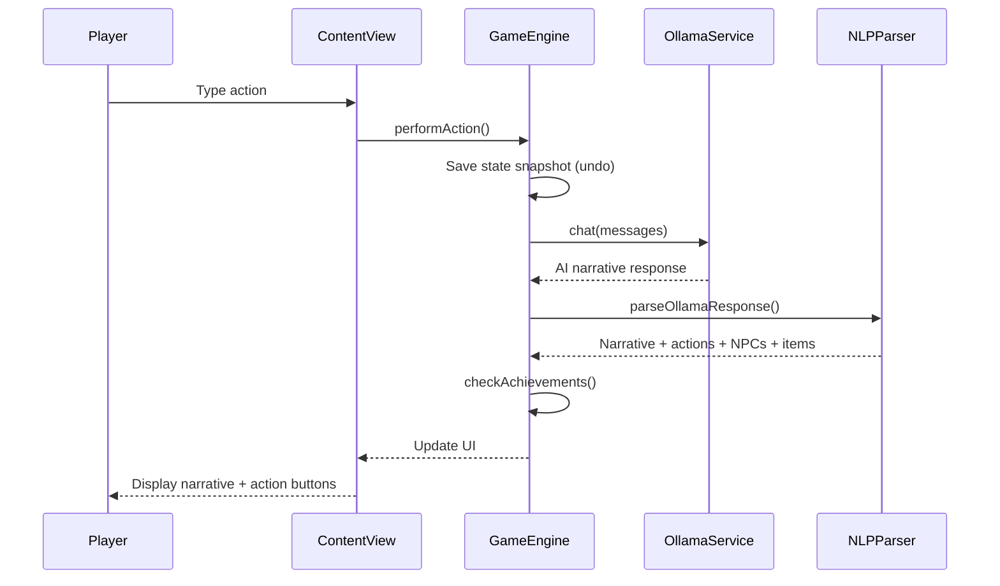

# Blompie


[](https://opensource.org/licenses/MIT)


**AI-powered text adventure engine for macOS -- every playthrough is unique.**

Blompie is a native macOS text adventure game that connects to local AI backends (Ollama, MLX) to generate infinite, procedural interactive fiction. An AI dungeon master creates characters, locations, plots, and consequences in real time based on free-form text input. No two sessions are ever the same.

Written by Jordan Koch.

---

## Architecture


```mermaid
graph TD
    A[BlompieApp] --> B[ContentView - Terminal UI]
    A --> C[NovaAPIServer - port 37426]
    A --> D[SharedDataManager]

    B --> E[GameEngine]
    C --> E

    E --> F[OllamaService]
    E --> G[NLP Parser]
    G --> H[NPCs]
    G --> I[Inventory]
    G --> J[Locations]
    E --> K[Achievement System]
    E --> L[Save/Load - 8 slots + autosave]
    E --> M[Undo Stack - 20 deep]

    F --> N[Ollama :11434]
    F --> O[MLX - Apple Silicon]

    P[AIBackendManager] --> Q[SwarmUI :7801]
    P --> R[ComfyUI :8188]
    P --> S[A1111 :7860]

    D --> T[Blompie Widget - WidgetKit]

    style A fill:#1a1a2e,color:#00ff00,stroke:#00ff00
    style E fill:#1a1a2e,color:#00ff00,stroke:#00ff00
```

### Gameplay Flow


```mermaid
sequenceDiagram
    participant Player
    participant ContentView
    participant GameEngine
    participant OllamaService
    participant NLPParser

    Player->>ContentView: Type action
    ContentView->>GameEngine: performAction()
    GameEngine->>GameEngine: Save state snapshot (undo)
    GameEngine->>OllamaService: chat(messages)
    OllamaService-->>GameEngine: AI narrative response
    GameEngine->>NLPParser: parseOllamaResponse()
    NLPParser-->>GameEngine: Narrative + actions + NPCs + items
    GameEngine->>GameEngine: checkAchievements()
    GameEngine-->>ContentView: Update UI
    ContentView-->>Player: Display narrative + action buttons
```

---

## Features

### Gameplay

| Feature | Details |
|---|---|
| Procedural adventures | AI generates every location, NPC, item, quest, and plot twist |
| Free-form input | Type anything in natural language; the AI adapts |
| Dynamic NPCs | Characters remember actions and have their own motivations |
| State tracking | Inventory, locations, and NPCs parsed from AI responses automatically |
| Achievements | 10+ unlockable achievements (Explorer, Diplomat, Collector, etc.) |
| Genres | Fantasy, sci-fi, mystery, horror, comedy |
| Tone control | Serious, Balanced, or Whimsical |
| Detail level | Brief, Normal, or Detailed descriptions |
| Random model mode | Auto-rotate Ollama models mid-adventure for unpredictable shifts |

### Save System

- 8 manual save slots plus autosave
- Undo stack (rewind up to 20 actions)
- Full transcript export as plain text

### Visual Design

- Retro terminal aesthetic (green-on-black default)
- 5 color themes: Classic Green, Amber Terminal, Retro Blue, Paper Mode, Matrix Green
- Adjustable font size with keyboard shortcuts
- Glassmorphic UI with smooth scrolling and monospaced type
- Real-time streaming (token-by-token) or instant mode
- Live tokens-per-second meter

### AI-Generated Imagery (Optional)

Scene illustrations, character portraits, item visualizations, and location artwork via SwarmUI, ComfyUI, or Automatic1111. Six prompt styles: Realistic, Artistic, Fantasy, Pixel Art, Cartoon, Anime.

### macOS Widget (WidgetKit)

| Size | Shows |
|---|---|
| Small | Adventure name, quick stats |
| Medium | Last action, action count, achievement progress |
| Large | Full game state, AI backend status, detailed progress |

Data syncs via App Group `group.com.jkoch.blompie`.

### Nova API Server

Local HTTP API on port **37426** (loopback only) for programmatic play by AI agents.

| Method | Endpoint | Description |
|---|---|---|
| GET | /api/status | App status and uptime |
| GET | /api/ping | Health check |
| GET | /api/models | Available Ollama models |
| POST | /api/adventure/new | Start a new adventure |
| GET | /api/adventure/sessions | List active sessions |
| GET | /api/adventure/:id/state | Current state (messages, inventory) |
| POST | /api/adventure/:id/action | Send a command, get AI response |
| GET | /api/adventure/:id/history | Full message history |
| POST | /api/adventure/:id/save | Save session to slot |
| POST | /api/adventure/:id/undo | Undo last action |
| DELETE | /api/adventure/:id | End and delete session |

---

## Requirements

| Requirement | Minimum | Recommended |
|---|---|---|
| macOS | 13.0 (Ventura) | 14.0+ (Sonoma) |
| RAM | 8 GB | 16 GB (for MLX) |
| Architecture | Universal (Intel + Apple Silicon) | Apple Silicon |
| AI Backend | Ollama or MLX | Ollama with mistral |

## Installation

### From DMG

Download from [Releases](https://github.com/kochj23/Blompie/releases), open the DMG, drag to Applications.

### From Source

```bash
git clone git@github.com:kochj23/Blompie.git
cd Blompie
open Blompie.xcodeproj
# Build: Cmd+R (Xcode 15+)
```

### AI Backend Setup

```bash
# Ollama (recommended)
brew install ollama
ollama serve
ollama pull mistral:latest
```

Blompie auto-detects MLX on Apple Silicon and falls back to Ollama if unavailable.

---

## How to Play

1. Launch Blompie. The AI generates an opening scene automatically.
2. Type any action: `look around`, `talk to the merchant`, `cast a spell on the door`.
3. Press Enter. The AI responds with narrative and suggested actions.
4. Click a suggested action or type your own.
5. System commands: `/save`, `/load`, `/undo`, `/stats`, `/help`.

---

## Supported AI Backends

| Backend | Type | Default Port | Notes |
|---|---|---|---|
| Ollama | Text LLM | 11434 | Primary, recommended |
| MLX | Text LLM | -- | Apple Silicon native |
| TinyLLM | Text LLM | 8000 | Lightweight server |
| TinyChat | Text LLM | 8000 | Jason Cox chatbot |
| OpenWebUI | Text LLM | 3000 | Self-hosted platform |
| SwarmUI | Image gen | 7801 | Flux models |
| ComfyUI | Image gen | 8188 | Node-based workflows |
| Automatic1111 | Image gen | 7860 | Stable Diffusion WebUI |

---

## Test Suite

235 tests across 9 test files covering game engine models, Ollama service contracts, color themes, AI backend management, security, widget data, response parsing, and Nova API integration.

```bash
xcodebuild -scheme Blompie -destination "platform=macOS" test
```

| Test File | Tests | Coverage |
|---|---|---|
| BlompieComprehensiveTests | 92 | Full integration and edge cases |
| GameEngineTests | 26 | Models, settings, undo, achievements |
| ResponseParsingTests | 26 | System prompts, save/load, streaming |
| AIBackendManagerTests | 26 | Backend detection, errors, image config |
| OllamaServiceTests | 17 | Codable contracts, token/sec calc |
| SecurityTests | 17 | API keys, passwords, loopback, sandbox |
| ColorThemeTests | 16 | All 5 themes, codable, uniqueness |
| WidgetDataTests | 9 | Widget models, progress, data manager |
| NovaAPIServerTests | 6 | Port, loopback, status, ping |

---

## Security and Privacy

- **100% local by default** -- all inference on your Mac, no data leaves the machine
- **No telemetry** -- zero analytics, tracking, or phone-home behavior
- **Keychain storage** -- API keys in macOS Keychain, never in plaintext
- **Ethical AI Guardian** -- mandatory content moderation layer on all AI I/O
- **Loopback-only API** -- Nova server binds to 127.0.0.1

---

## License

MIT License -- Copyright 2024-2026 Jordan Koch

See [LICENSE](LICENSE) for the full text.

---

Written by Jordan Koch ([@kochj23](https://github.com/kochj23))
